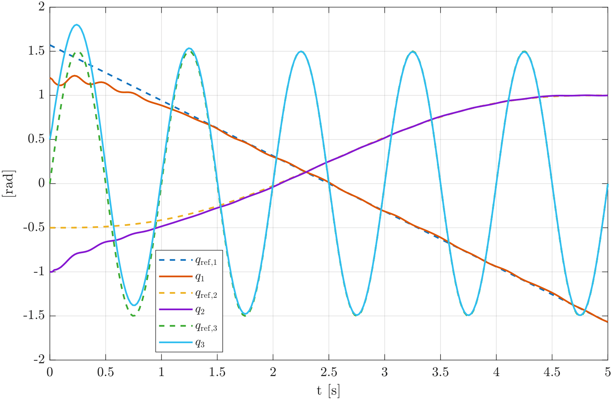
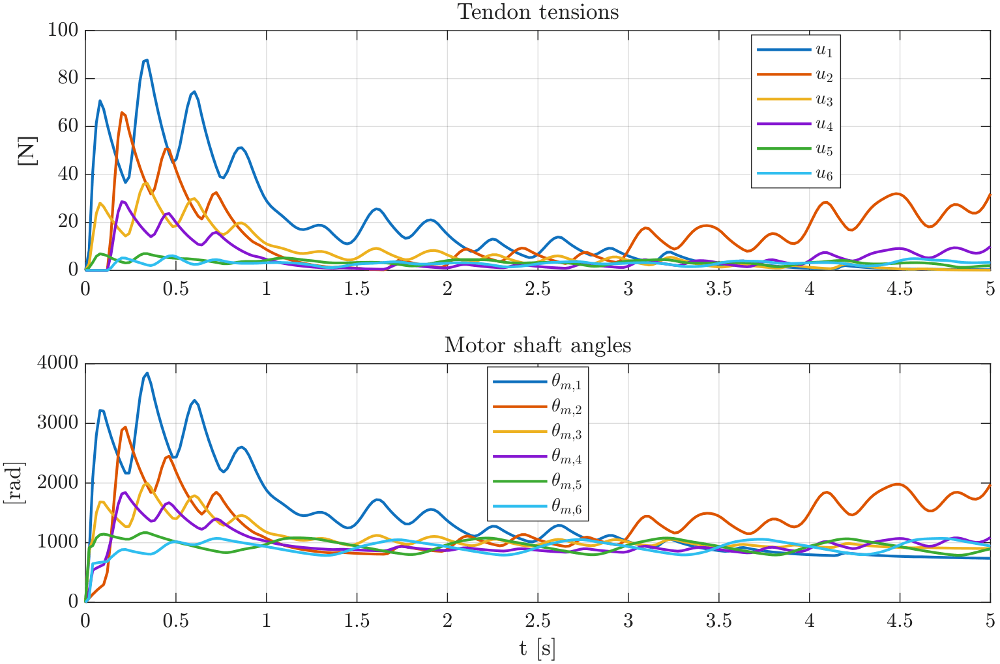

# Planar 2D Simulation Case

This folder contains supplementary simulation results for the planar tendon-driven continuum arm.

## System description

The planar case considers a tendon-driven continuum arm composed of three Piecewise Constant Curvature (PCC) segments. Each segment is actuated by one antagonistic tendon pair and controlled through its scalar curvature coordinate \(q_i\).

The purpose of this simulation is to illustrate how curvature-level control efforts are converted into non-negative tendon tensions and then into motor commands through the proposed control-allocation and motor--tendon model.

## Controlled variables

For the planar case, the controlled curvature vector is

```math
q = [q_1, q_2, q_3]^\top
```

where each \(q_i\) represents the bending angle of the corresponding PCC segment.

## Reference trajectories

The three segments follow different curvature references:

- **Segment 1:** linear reference trajectory.
- **Segment 2:** smooth quintic reference trajectory.
- **Segment 3:** sinusoidal reference trajectory.

These references were selected to evaluate the response of the control-allocation framework under different motion profiles.

## Figures

### Curvature tracking



This figure shows the desired and actual curvature trajectories for the three planar PCC segments. The plot illustrates that the reduced curvature coordinates track their corresponding references.

### Tendon tensions and motor shaft angles



This figure shows the tendon tensions generated by the allocation strategy and the corresponding motor shaft angles produced by the actuator model.

## Animation

The planar animation shows the motion of the three-segment soft arm during curvature tracking.

Video file:

```text
videos/planar_case_animation.mp4
```

## Files

```text
figures/planar_tracking.png
figures/planar_tracking.pdf
figures/planar_tensions_motors.png
figures/planar_tensions_motors.pdf
videos/planar_case_animation.mp4
```

## Notes

This planar case is provided as supplementary material to complement the spatial 3D simulation case reported in the main paper.
