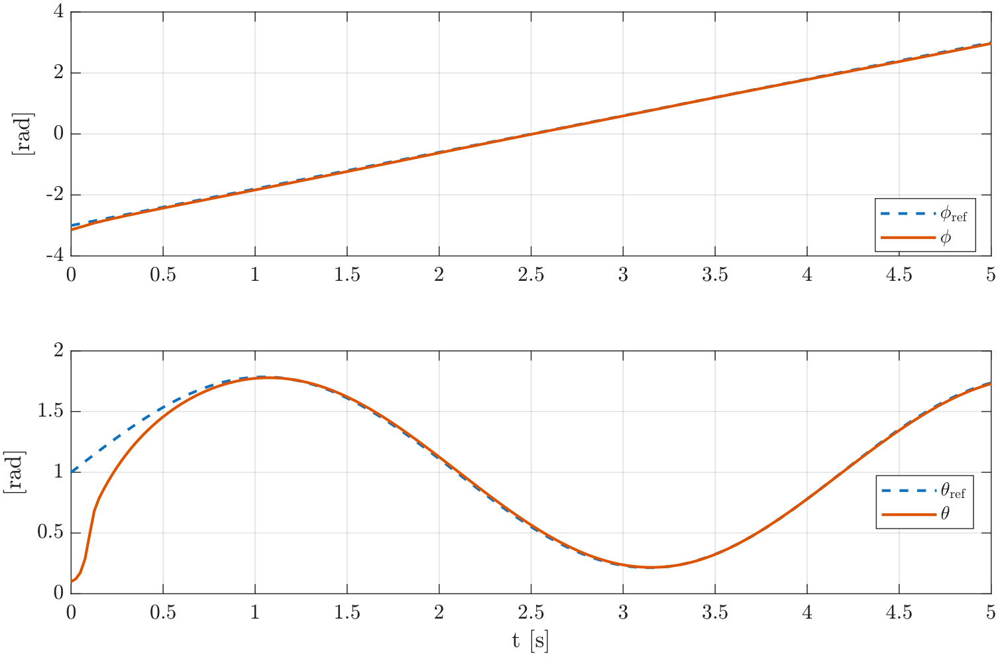
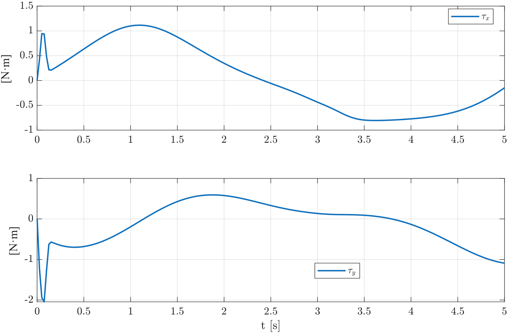
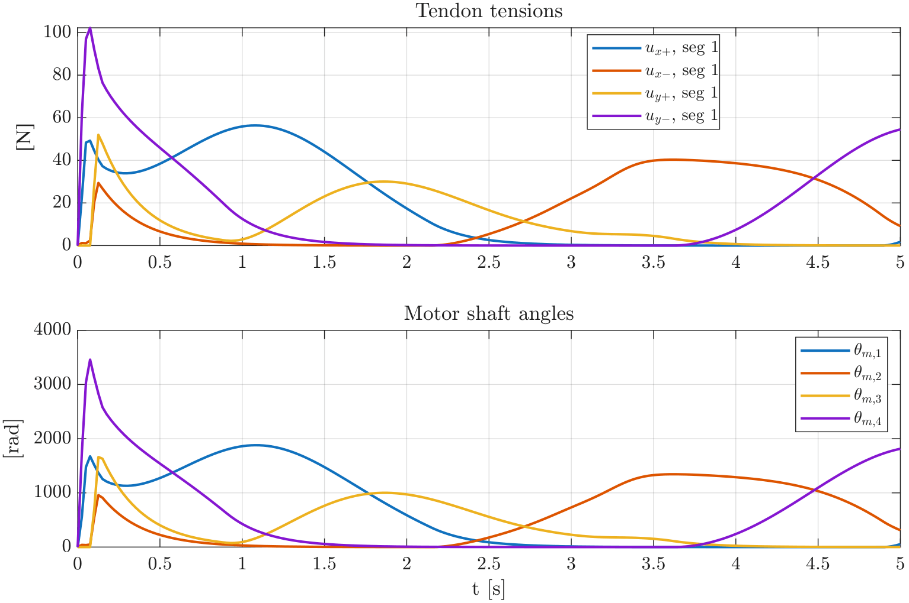
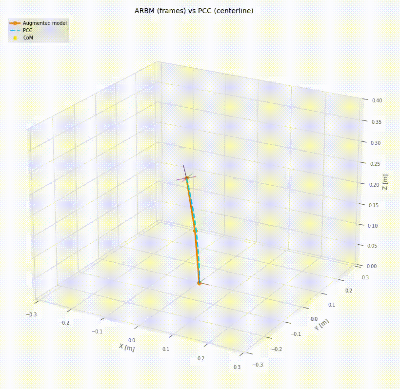

# Spatial 3D Simulation Case

This folder contains simulation results for the spatial tendon-driven continuum arm associated with the paper:

**"A Control Allocation Strategy for Tendon-driven Arms Modeled Via the Augmented Rigid Body Approach"**

## System description

The spatial case considers a single 3D Piecewise Constant Curvature (PCC) segment. The segment is actuated by four tendons arranged as two antagonistic pairs, associated with bending about two local orthogonal axes.

The segment is controlled through the generalized coordinates

```math
q = [\phi, \theta]^\top
```

where:
- `phi`  is the bending-plane orientation,
- θ is the bending magnitude.

The purpose of this simulation is to illustrate how curvature-space control efforts are mapped into internal bending torques, tendon tensions, and motor commands through the proposed control-allocation and motor--tendon model.

## Controlled variables

The controlled output is the spatial curvature configuration of the segment:

```math
q(t) = [\phi(t), \theta(t)]^\top.
```

The controller tracks desired references for both the bending-plane orientation and the bending magnitude.

## Reference trajectories

The 3D segment follows two independent references:

- **Bending-plane orientation** `phi(t)`: ramp reference from a negative to a positive orientation.
- **Bending magnitude** `theta(t)`: sinusoidal reference with a positive bias.

These references were selected to evaluate spatial bending-plane reorientation together with a time-varying curvature magnitude.

## Figures

### Tracking of `phi(t)` and `theta(t)`



This figure shows the desired and actual trajectories for the bending-plane orientation `phi(t)` and the bending magnitude `theta(t)`.

### Internal bending torques



This figure shows the internal bending torques `(tau_x, tau_y)` generated by the actuator system. These torques correspond to the local bending directions before being mapped into curvature-space generalized efforts.

### Tendon tensions and motor shaft angles



This figure shows the tendon tensions generated by the allocation strategy and the corresponding motor shaft angles produced by the motor--tendon model.

## Animation

The spatial animation shows the motion of the 3D tendon-driven continuum segment during curvature tracking.




## Notes

This spatial 3D case is the main simulation case reported in the paper.
